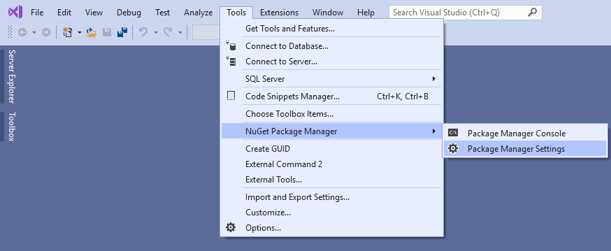
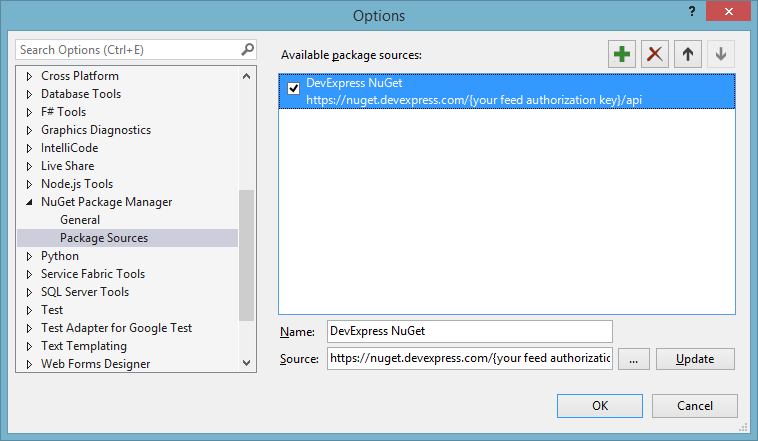
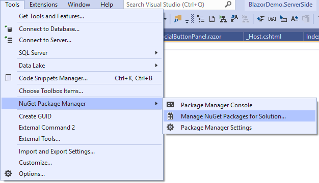
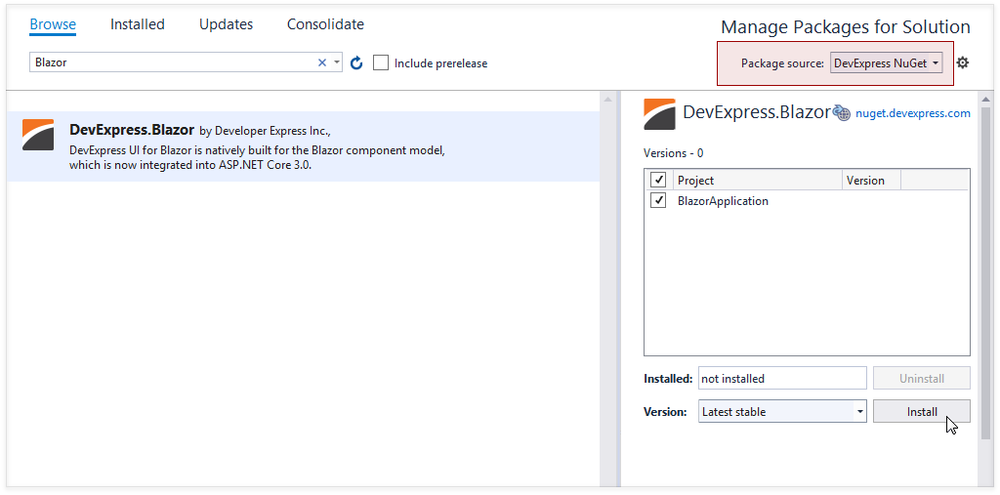
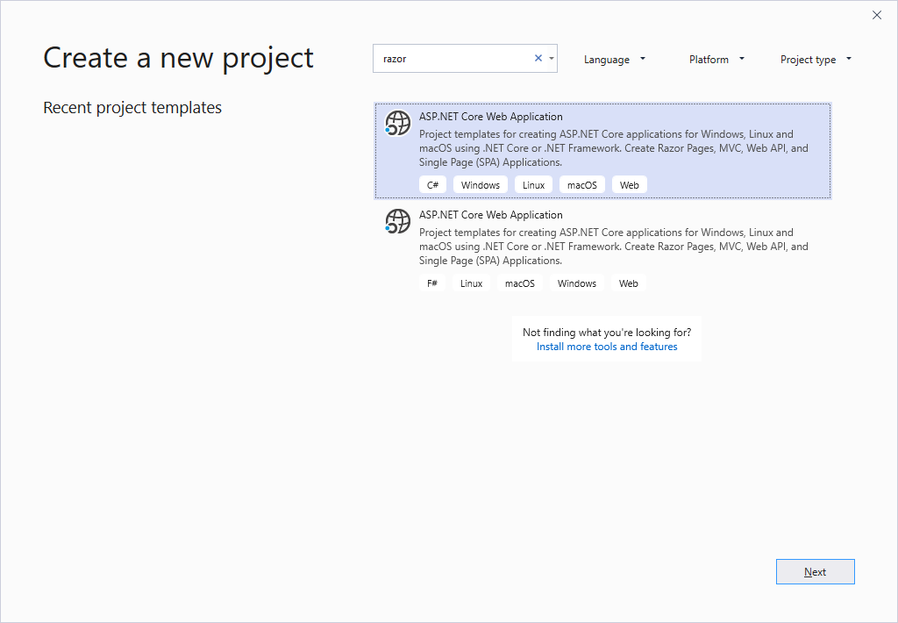
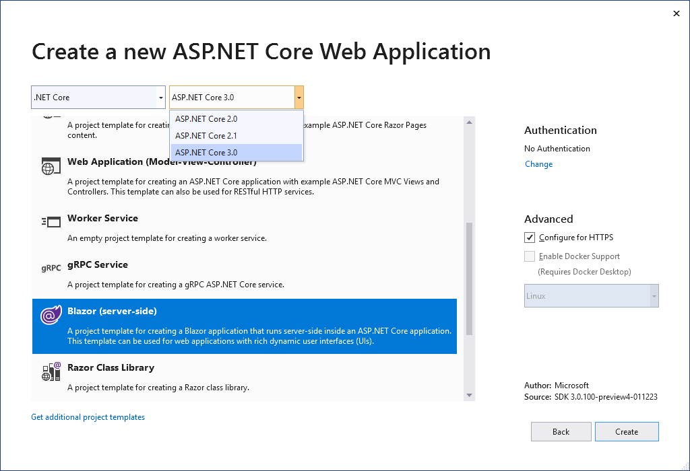
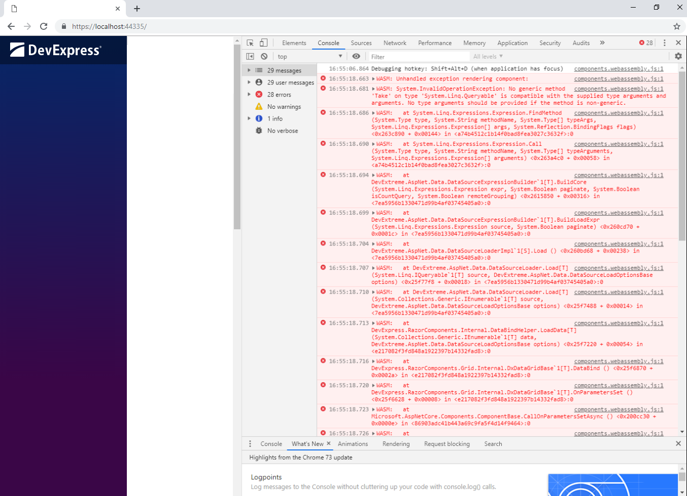

# DevExpress UI for Blazor
This project demonstrates the [DevExpress UI Components for Blazor](https://www.devexpress.com/blazor/).

The DevExpress UI components featured in this demo are available for free download and can be used in your next Blazor app.

* [Live Demo](#live-demo)
* [Examples](#examples)
* [Documentation](#documentation)
* [Version Compatibility](#version-compatibility)
* [Set Up Your Environment](#set-up-your-environment)
* [How to Run This Demo Locally](#how-to-run-this-demo-locally)
* [How to Create a New Project](#how-to-create-a-new-project)
* [Themes](#themes)
* [Localization](#localization)
* [Free Blazor Utilities and Dev Tools](#free-blazor-utilities-and-dev-tools)
* [Troubleshooting](#troubleshooting)
* [Included Demo Modules](#included-demo-modules)

# Live Demo
 
Check out this [demo in live](https://demos.devexpress.com/blazor/).

# Examples 

DevExpress Blazor components are shipped with GitHub feature-based examples. Refer to [examples.md](examples.md) for more information.

# Documentation 

Our online documentation is available at [docs.devexpress.com/Blazor/](https://docs.devexpress.com/Blazor/400725/blazor-components).

# Version Compatibility

The following table describes the version compatibility of .NET Core and the DevExpress.Blazor NuGet package:

| .NET Core 3.0 version | DevExpress.Blazor.nuget version |
| ------------- | ------------- |
| [.NET Core 3.1.1 Release](https://devblogs.microsoft.com/dotnet/net-core-january-2020/) | **19.2.2 Beta**&#42; (make sure the [Include prerelease](#InstallPackage) option is enabled) |
| [.NET Core 3.1 Release](https://devblogs.microsoft.com/dotnet/announcing-net-core-3-1/) | **19.2.1 Beta**&#42; (make sure the [Include prerelease](#InstallPackage) option is enabled) |
| [.NET Core 3.1 Release](https://devblogs.microsoft.com/dotnet/announcing-net-core-3-1/) | **19.1.10 Release**&#42; |
| [.NET Core 3.0 Release](https://devblogs.microsoft.com/aspnet/asp-net-core-and-blazor-updates-in-net-core-3-0/) | **19.1.9 Release**&#42; |
| [.NET Core 3.0 Release](https://devblogs.microsoft.com/aspnet/asp-net-core-and-blazor-updates-in-net-core-3-0/) | **19.1.8 Release**&#42; |
| [.NET Core 3.0 Release](https://devblogs.microsoft.com/aspnet/asp-net-core-and-blazor-updates-in-net-core-3-0/) | **19.1.7 Release**&#42; |
| [.NET Core 3.0 RC1](https://devblogs.microsoft.com/aspnet/asp-net-core-and-blazor-updates-in-net-core-3-0-release-candidate-1/) | **0.4.1 RC** |
| [.NET Core 3.0 RC1](https://devblogs.microsoft.com/aspnet/asp-net-core-and-blazor-updates-in-net-core-3-0-release-candidate-1/) | **0.4.0 RC** |
| [.NET Core 3.0 RC1](https://devblogs.microsoft.com/aspnet/asp-net-core-and-blazor-updates-in-net-core-3-0-release-candidate-1/) | **0.3.3 Beta** |
| [.NET Core 3.0 Preview **9**](https://devblogs.microsoft.com/aspnet/asp-net-core-and-blazor-updates-in-net-core-3-0-preview-9/) | **0.3.2 Beta** |
| [.NET Core 3.0 Preview **9**](https://devblogs.microsoft.com/aspnet/asp-net-core-and-blazor-updates-in-net-core-3-0-preview-9/) | **0.3.1 Beta** |
| [.NET Core 3.0 Preview **8**](https://devblogs.microsoft.com/aspnet/asp-net-core-and-blazor-updates-in-net-core-3-0-preview-8/) | **0.3.0 Beta** |
| [.NET Core 3.0 Preview **8**](https://devblogs.microsoft.com/aspnet/asp-net-core-and-blazor-updates-in-net-core-3-0-preview-8/) | **0.2.0 Beta** |
| [.NET Core 3.0 Preview **7**](https://devblogs.microsoft.com/aspnet/asp-net-core-and-blazor-updates-in-net-core-3-0-preview-7/) | **0.1.0 Beta** |
| [.NET Core 3.0 Preview **6**](https://devblogs.microsoft.com/aspnet/asp-net-core-and-blazor-updates-in-net-core-3-0-preview-6/) | 0.0.**12** |
| [.NET Core 3.0 Preview **6**](https://devblogs.microsoft.com/aspnet/asp-net-core-and-blazor-updates-in-net-core-3-0-preview-6/) | 0.0.**11** |
| [.NET Core 3.0 Preview **6**](https://devblogs.microsoft.com/aspnet/asp-net-core-and-blazor-updates-in-net-core-3-0-preview-6/) | 0.0.**10** |
| .NET Core 3.0 Preview **5** | 0.0.**9** |
| .NET Core 3.0 Preview **5** | 0.0.**8** |
| .NET Core 3.0 Preview **5** | 0.0.**7** |
| .NET Core 3.0 Preview **5** | 0.0.**6** |
| .NET Core 3.0 Preview **5** | 0.0.**5** |
| .NET Core 3.0 Preview **4** | 0.0.**4** |
| .NET Core 3.0 Preview **3** | 0.0.**3** |

> &#42; Starting with v19.1.7, DevExpress UI components for Blazor are distributed through a [personal NuGet feed](https://nuget.devexpress.com/). Register at [devexpress.com](https://www.devexpress.com/) to subscribe to the feed.


# Set Up Your Environment

1. Install the latest Visual Studio 2019 update with the **ASP.NET and web development** workload.
2. Ensure that you have the latest .NET Core 3 version (from supported versions listed above) installed.

# How to Run This Demo Locally

The Blazor framework uses either WebAssembly-based .NET runtime (**client-side Blazor**) or server-side ASP.NET Core (**server-side Blazor**). Our Blazor components support both of these approaches. 

You can find appropriate demos in the repositories below:

* demo/BlazorDemo.ServerSide
* demo/BlazorDemo.ClientSide
* demo/BlazorDemo.ClientSideWithPrerendering&#42; 

> &#42; For more information, see the [Update Metadata at Runtime - Free SEO Tool](https://community.devexpress.com/blogs/aspnet/archive/2019/06/27/devexpress-blazor-update-metadata-at-runtime-free-seo-tool.aspx) blog post.

To open the required demo, do the following:

1. Download the "**demo**" and **tools** folders from the proper repository.
2. Use Visual Studio 2019 to open the solution file:
	
	**demo/BlazorDemo.ServerSide/BlazorDemo.ServerSide.sln**
	
	or
	
	**demo/BlazorDemo.ClientSide/BlazorDemo.ClientSide.sln** 
	
	or
	
	**demo/BlazorDemo.ClientSideWithPrerendering/BlazorDemo.ClientSideWithPrerendering.sln** 
	  
3. Go to [nuget.devexpress.com](https://nuget.devexpress.com), log in as a registered DevExpress customer and click **Obtain Feed URL**. The subsequent page displays a development account's NuGet Feed URL.

   Open the "Package Manager Settings".

   

   Add new NuGet source:
  
   ```https://nuget.devexpress.com/{your feed authorization key}/api```

   
   
   > Make sure the `nuget.org` package source is also enabled.

4. Install the "DevExpress.Blazor" NuGet package.

   Navigate to:
   
   
   
   Install the "DevExpress.Blazor" NuGet package.

   To install the latest Release package version, clear the **Include prereleases** checkbox. To test a Beta version of the "DevExpress.Blazor" NuGet package, make sure that the **Include prerelease** option is enabled.
   
    

5. Start the application.

See also: 

[Official Microsoft Blazor site](https://dotnet.microsoft.com/apps/aspnet/web-apps/client)

# How to Create a New Project

Follow the steps below to try our UI for Blazor in your own application. 

1. In the "Create a new project" dialog select "Blazor App".
  
  

  In the next step select a project template.
  
  

2. Go to [nuget.devexpress.com](https://nuget.devexpress.com), log in as a registered DevExpress customer and click **Obtain Feed URL**. The subsequent page displays a development account's NuGet Feed URL.

   Open the "Package Manager Settings".

   

   Add new NuGet source:
  
   ```https://nuget.devexpress.com/{your feed authorization key}/api```

   
   
   > Make sure the `nuget.org` package source is also enabled.

3. Install the "DevExpress.Blazor" NuGet package.

   Navigate to:
   
   
   
   <a name="InstallPackage"/>Install the "DevExpress.Blazor" NuGet package.

   To install the latest Release package version, clear the **Include prereleases** checkbox. To test a Beta version of the "DevExpress.Blazor" NuGet package, make sure that the **Include prerelease** option is enabled.
   
    
4. Build the project.
5. Link the following file to your layout’s HEAD section:
   * For server-side Blazor, add the line below to the `_Host.cshtml` file. 
        ```Razor
        <head>
            ...
            <link href="_content/DevExpress.Blazor/dx-blazor.css" rel="stylesheet" />
        </head>
        ```
    * For client-side Blazor, add the line below to the `index.html` file.
        ```Razor
        <head>
            ...
            <link href="_content/DevExpress.Blazor/dx-blazor.css" rel="stylesheet" />
        </head>
        ```
        Call the [AddDevExpressBlazor](https://docs.devexpress.com/Blazor/Microsoft.Extensions.DependencyInjection.DevExpressServiceCollectionExtensions.AddDevExpressBlazor(Microsoft.Extensions.DependencyInjection.IServiceCollection)) method from your project's  `Startup.ConfigureServices()` method:
        ```csharp
        using Microsoft.Extensions.DependencyInjection;

        public class Startup {
            public Startup(IConfiguration configuration) {
                Configuration = configuration;
            }

            public IConfiguration Configuration { get; }

            public void ConfigureServices(IServiceCollection services) {
                ...
                services.AddDevExpressBlazor();
            }
        }
        ```  
6. Register DevExpress.Blazor namespace in _\_Imports.razor_ file:

   ```html
   @using DevExpress.Blazor
   ```

7. Your application is ready to use DevExpress Blazor.

# Themes

DevExpress Blazor components use the client-side Bootstrap framework to render their user interface. You can apply a Bootstrap-based theme to a Blazor application to change the appearance of all the components. Refer to the [Themes](http://docs.devexpress.com/Blazor/401523/common-concepts/themes) help topic for more information.

# Localization

DevExpress Blazor components ship localizable resources for UI elements, such as button captions, menu items, error messages, and dialog boxes. Refer to [localization.md](localization.md) for more information.

# Free Blazor Utilities and Dev Tools

The following DevExpress Blazor products are available free-of-charge:

* [Document metadata tool](https://github.com/DevExpress/Blazor/tree/master/tools/DevExpress.Blazor.DocumentMetadata).
* [Anchor navigation tool](https://github.com/DevExpress/Blazor/tree/master/tools/DevExpress.Blazor.AnchorUtils).

# Troubleshooting

## 1. There was an unhandled exception on the current circuit, so this circuit will be terminated. For more details turn on detailed exceptions in 'CircuitOptions.DetailedErrors'.

If you see this error message or a similar message, add the following code to the `ConfigureServices` method declared in the *Startup.cs* file: 

```cs
services.AddServerSideBlazor().AddCircuitOptions(options => { options.DetailedErrors = true; });
```

This provides more detailed information about these errors. 

## 2. System.ArgumentNullException: Value cannot be null. (Parameter 'accessor') 
 
To resolve this issue, use the solution from the [ComboBox for Blazor - How to resolve the 'System.ArgumentNullException: Value cannot be null. (Parameter 'accessor')' error](https://supportcenter.devexpress.com/ticket/details/t850754/combobox-for-blazor-how-to-resolve-the-system-argumentnullexception-value-cannot-be-null) ticket.

## 3. Could not find 'X' in 'window.DxBlazor'.
Earlier, our clients' scripts were manually added to a project. Now, we automatically distribute them with the NuGet Package in the lib/dx-blazor folder (see the 6th item of the [How to create a new project](https://github.com/devexpress/blazor#how-to-create-a-new-project) paragraph). So, our users may face such an issue if they reference an old version of our static files instead of the new one. For example, a similar issue was discussed in the [I have a formlayout error when running a Blazor website](https://stackoverflow.com/questions/57593583/i-have-a-formlayout-error-when-running-a-blazor-website) SO thread.
 
If solutions suggested there do not help, create an issue here or submit a ticket in our [Support Center](https://www.devexpress.com/Support/Center/Question/Create) so that we can investigate your case.

## 4. DxDataGrid in Blazor

If you use Blazor WebAssemly (aka client-side Blazor) with DxDataGrid, you may see the following exception in a browser:



> "System.InvalidOperationException: No generic method 'Take' on type 'System.Linq.Queryable' is compatible with the supplied type arguments and arguments."

Do one of the following to resolve this issue:

* Set the `BlazorLinkOnBuild` property to **false** in the project file to disable linking with a MSBuild property.

  ```
  <PropertyGroup>
    ...
    <BlazorLinkOnBuild>false</BlazorLinkOnBuild>
  </PropertyGroup>
  ```  

* Add the **Linker.xml** file and include the following assemblies and types:

  ```
  <?xml version="1.0" encoding="UTF-8" ?>
  ...
  <linker>
    <assembly fullname="mscorlib">
    ...
      <type fullname="System.Threading.WasmRuntime" />
    </assembly>
    <assembly fullname="System.Core">
    ...
      <type fullname="System.Linq.Expressions*" />
      <type fullname="System.Linq.Queryable*" />
      <type fullname="System.Linq.Enumerable*" />
      <type fullname="System.Linq.EnumerableRewriter*" />
    </assembly>
    ...
    <assembly fullname="[PUT YOUR ASSEMBLY NAME HERE]" />
  </linker>
  ```

  Specify this file as a MSBuild item in the project file.  

  ```
  <ItemGroup>
    ...
    <BlazorLinkerDescriptor Include="Linker.xml" />
  </ItemGroup>
  ```  

See [Configure the Linker for ASP.NET Core Blazor](https://docs.microsoft.com/en-us/aspnet/core/host-and-deploy/blazor/configure-linker?view=aspnetcore-3.0) for more information.


## 5. DxScheduler in Blazor

If you use client-side Blazor with DxScheduler, you may see the following exception or a similar exception:

> "System.MissingMethodException: Constructor on type 'System.ComponentModel.Int32Converter' not found."

Do one of the following to resolve this issue:

* Set the `BlazorLinkOnBuild` property to **false** in the project file to disable linking with a MSBuild property.

  ```
  <PropertyGroup>
    ...
    <BlazorLinkOnBuild>false</BlazorLinkOnBuild>
  </PropertyGroup>
  ```  

* Add the **Linker.xml** file and include the following assembly:

  ```
  <?xml version="1.0" encoding="UTF-8" ?>
  ...
  <linker>
    ...
    <assembly fullname="System">
      <!--Use this line to include the entire assembly.-->
      <type fullname="System.ComponentModel*" />
      <!--Uncomment the following lines to include individual types. -->
      <!--<type fullname="System.ComponentModel.Int32Converter*" />
      <type fullname="System.ComponentModel.BooleanConverter*" />
      <type fullname="System.ComponentModel.DateTimeConverter*" />
      <type fullname="System.ComponentModel.StringConverter*" />-->
      ...
    </assembly>
  </linker>
  ```

  Specify this file as a MSBuild item in the project file.  

  ```
  <ItemGroup>
    ...
    <BlazorLinkerDescriptor Include="Linker.xml" />
  </ItemGroup>
  ```  

See [Configure the Linker for ASP.NET Core Blazor](https://docs.microsoft.com/en-us/aspnet/core/host-and-deploy/blazor/configure-linker?view=aspnetcore-3.0) for more information.

## 6. DxTabs are rendered incorrectly when the default Microsoft template is applied

If you create a new Blazor project based on the default Microsoft project template, the first tab of the DxTabs component can be rendered incorrectly.

This is caused by the following Microsoft issues:
* https://github.com/aspnet/AspNetCore/issues/11267
* https://github.com/aspnet/Blazor/issues/1203

To resolve this issue, write more strict style rules in the *site.css* file so that they only apply `.navbar` templates.

# Included Demo Modules

* Data Grid
  * Column Types
  * Sort Data
  * Grouping
  * Filter Row
  * Selection
  * Templates
  * Scrolling
  * Virtual Scrolling
  * Cascading Editors
  * Edit Form Template Validation
  * Remote Data Source
  * Large Datasets
  * Master-Detail
  * HTML Decoration
* Pivot Grid
  * Data Binding Basics
  * Templates
  * Large Datasets
  * Chart Integration
* Charts
  * Series Types
  * Dynamic Series
  * Range Series
  * Financial Series
  * Pie Series
  * Customization
  * Series Customization
* Scheduler
  * Day View
  * Work Week View
  * Week View
  * Recurring Appointments
* Data Editors
  * Calendar
  * CheckBox
  * ComboBox
  * Date Edit
  * List Box
  * Spin Edit
  * Text Box
* Navigation and Layout
  * Form Layout
  * Pager
  * Popup
  * Tabs
  * TreeView
* Form Validation

# NuGet Package Change Log

Check out thе NuGet package's [version history](changelog.md).
