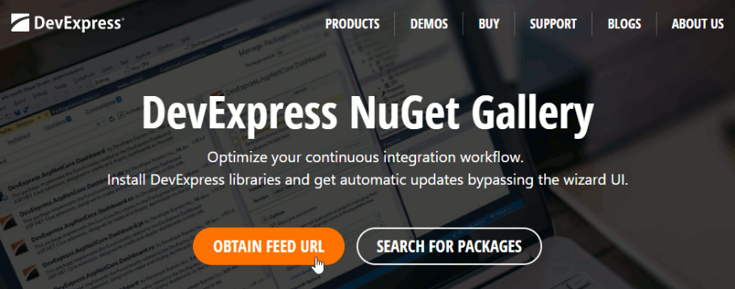
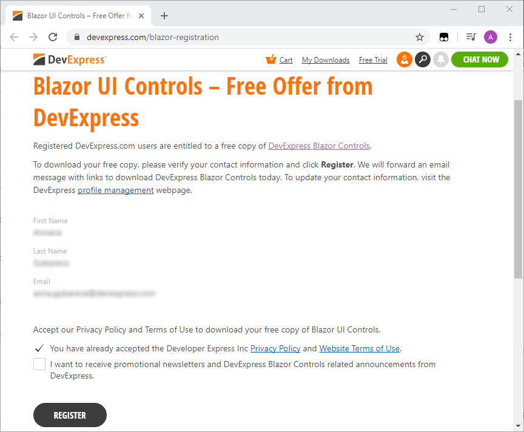
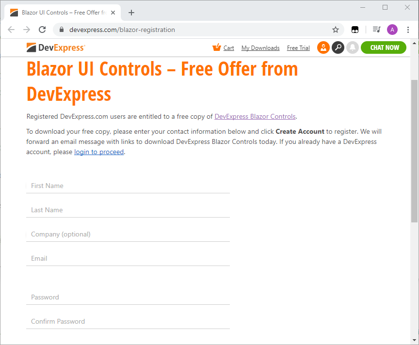

# DevExpress UI for Blazor

[DevExpress UI for Blazor](https://www.devexpress.com/blazor/) ships with over 15 UI components (including a Data Grid, Pivot Grid, Scheduler, and Charts) so you can design rich user experiences for both Blazor Server and Blazor WebAssembly.

* [Online Demos](#online-demos)
* [Code Examples](#code-examples)
* [Documentation](#documentation)
* [Blog](#blog)
* [Version Compatibility](#version-compatibility)
* [Set Up Your Environment](#set-up-your-environment)
* [Get NuGet Feed](#get-nuget-feed)
* [Run Demos Locally](#run-demos-locally)
* [Create a New Project](#create-a-new-project)
* [Themes](#themes)
* [Localization](#localization)
* [Free Blazor Utilities and Dev Tools](#free-blazor-utilities-and-dev-tools)
* [Troubleshooting](#troubleshooting)
* [Included Demo Modules](#included-demo-modules)
* [NuGet Package Change Log](#nuget-package-change-log)

# Online Demos

DevExpress Blazor components are shipped with [online feature-based demos](https://demos.devexpress.com/blazor/).

# Code Examples 

Refer to [examples.md](examples.md) for information about GitHub feature-based examples for DevExpress Blazor components.

# Documentation 

Our online documentation is available at [docs.devexpress.com/Blazor/](https://docs.devexpress.com/Blazor/400725/blazor-components).

# Blog

Read about the latest updates to DevExpress Blazor components on our [blog](https://community.devexpress.com/tags/Blazor/default.aspx).

# Version Compatibility

The following table describes the version compatibility of .NET Core and the DevExpress.Blazor NuGet package:

| Supported frameworks | DevExpress.Blazor.nuget version |
| ------------- | ------------- |
| [.NET Core 3.1.5 Release](https://devblogs.microsoft.com/dotnet/net-core-june-2020-updates-2-1-19-and-3-1-5/) <br /> [Blazor WebAssembly 3.2.0 Release](https://devblogs.microsoft.com/aspnet/blazor-webassembly-3-2-0-now-available/) | **20.1.5-Release** |
| [.NET Core 3.1.4 Release](https://devblogs.microsoft.com/dotnet/net-core-may-2020/) <br /> [Blazor WebAssembly 3.2.0 Release](https://devblogs.microsoft.com/aspnet/blazor-webassembly-3-2-0-now-available/) | **20.1.4-Release** |
| [.NET Core 3.1.3 Release](https://github.com/dotnet/core/blob/master/release-notes/3.1/3.1.3/3.1.3.md) <br /> [Blazor WebAssembly 3.2.0 Preview 4](https://devblogs.microsoft.com/aspnet/blazor-webassembly-3-2-0-preview-4-release-now-available/) | **19.2.5-Preview** (make sure the [Include prerelease](#InstallPackage) option is enabled) |
| [.NET Core 3.1.2 Release](https://devblogs.microsoft.com/dotnet/net-core-february-2020/) <br /> [Blazor WebAssembly 3.2.0 Preview 1](https://devblogs.microsoft.com/aspnet/blazor-webassembly-3-2-0-preview-1-release-now-available/) | **19.2.4-Release** |
| [.NET Core 3.1.1 Release](https://devblogs.microsoft.com/dotnet/net-core-january-2020/) <br /> [Blazor WebAssembly 3.2.0 Preview 1](https://devblogs.microsoft.com/aspnet/blazor-webassembly-3-2-0-preview-1-release-now-available/) | **19.2.3 Release** |
| [.NET Core 3.1.1 Release](https://devblogs.microsoft.com/dotnet/net-core-january-2020/) | **19.2.2 Beta** (make sure the [Include prerelease](#InstallPackage) option is enabled) |
| [.NET Core 3.1 Release](https://devblogs.microsoft.com/dotnet/announcing-net-core-3-1/) | **19.2.1 Beta** (make sure the [Include prerelease](#InstallPackage) option is enabled) |
| [.NET Core 3.1 Release](https://devblogs.microsoft.com/dotnet/announcing-net-core-3-1/) | **19.1.10 Release** |
| [.NET Core 3.0 Release](https://devblogs.microsoft.com/aspnet/asp-net-core-and-blazor-updates-in-net-core-3-0/) | **19.1.9 Release** |
| [.NET Core 3.0 Release](https://devblogs.microsoft.com/aspnet/asp-net-core-and-blazor-updates-in-net-core-3-0/) | **19.1.8 Release** |
| [.NET Core 3.0 Release](https://devblogs.microsoft.com/aspnet/asp-net-core-and-blazor-updates-in-net-core-3-0/) | **19.1.7 Release** |

> Starting with v19.1.7, DevExpress UI components for Blazor are distributed through a [personal NuGet Feed URL](#get-nuget-feed). 


# Set Up Your Environment

## Blazor Server

1. Install the latest [Visual Studio 2019](https://visualstudio.microsoft.com/) version with the **ASP.NET and web development** workload.
2. Install [.NET Core 3.1 SDK](https://dotnet.microsoft.com/download/dotnet-core/3.1).

## Blazor WebAssembly

1. Install the latest [Visual Studio 2019](https://visualstudio.microsoft.com/) version with the **ASP.NET and web development** workload.
2. Install [.NET Core 3.1.300 SDK](https://dotnet.microsoft.com/download/dotnet-core/3.1) or later.

# Get NuGet Feed

Get the **Blazor UI Component** subscription and your personal NuGet Feed URL to use DevExpress Blazor components.

## Universal/DXperience/ASP.NET Subsription

The **Blazor UI Component** subscription is available if you purchased the **Universal**, **DXperience**, or **ASP.NET** subscription. Refer to the [subscription comparison table](https://www.devexpress.com/buy/net/) for more information.

Go to [nuget.devexpress.com](https://nuget.devexpress.com/), login as a registered DevExpress customer, [obtain your NuGet Feed URL](https://docs.devexpress.com/GeneralInformation/116042), and copy it to clipboard.



You can also access this NuGet Feed URL in the [Download Manager](https://www.devexpress.com/clientcenter/downloadmanager/).

## Free Blazor UI Component Subsription

For a limited time, you can obtain the **Blazor UI Component** subscription free-of-charge.

Go to the [Blazor Registration](https://www.devexpress.com/blazor-registration) page and register your personal information.

* If you already have a DevExpress account, login, verify your contact information, and click **Register**.

    

* If you do not have a DevExpress account, enter you contact information and click **Create Account**.

    

Open the message that was sent to your email address, and copy the NuGet Feed URL to clipboard. You can also access this NuGet Feed at [nuget.devexpress.com](https://nuget.devexpress.com/) or in the [Download Manager](https://www.devexpress.com/clientcenter/downloadmanager/).

# Run Demos Locally

The Blazor framework uses either WebAssembly-based .NET runtime (**Blazor WebAssembly**) or server-side ASP.NET Core (**Blazor Server**). Our Blazor components support both of these approaches. 

You can find appropriate demos in the repositories below:

* demo/BlazorDemo.ServerSide
* demo/BlazorDemo.ClientSide
* demo/BlazorDemo.ClientSideWithPrerendering - This project uses the DevExpress SEO Metadata Utility. For more information, refer to the following blog post: [Update Metadata at Runtime - Free SEO Tool](https://community.devexpress.com/blogs/aspnet/archive/2019/06/27/devexpress-blazor-update-metadata-at-runtime-free-seo-tool.aspx). Make sure that you [run this demo correctly](#ClientSideWithPrerendering).

> **Important Note**
>
> **Reporting Demos** are in the **BlazorDemo.ServerSide** folder. Note that DevExpress Reporting is not included in the *Blazor UI Component Subscription*. You should purchase the *Reporting Subscription*, *ASP.NET Subscription*, _DXperience_, or _Universal_. Refer to the [product matrix](https://www.devexpress.com/buy/net/) for more information.

To open the required demo, do the following:

1. Download the "**demo**" and **tools** folders from the proper repository.
2. Use Visual Studio 2019 to open the solution file:
	
	**demo/BlazorDemo.ServerSide/BlazorDemo.ServerSide.sln**
	
	or
	
	**demo/BlazorDemo.ClientSide/BlazorDemo.ClientSide.sln** 
	
	or
	
	**demo/BlazorDemo.ClientSideWithPrerendering/BlazorDemo.ClientSideWithPrerendering.sln** 
	  
3. [Get your personal NuGet Feed URL](#get-nuget-feed) and open the **Package Manager Settings**.

   

   Add a new NuGet package source:
  
   ```https://nuget.devexpress.com/{your feed authorization key}/api```

   
   
   > Make sure the `nuget.org` package source is also enabled.

4. Select **Tools** -> **NuGet Package Manager** -> **Manage NuGet Packages for Solution**. 
   
   
   
5. In the invoked dialog, open the **Browse** tab, select the created package source, and install the `DevExpress.Blazor` NuGet package.
 
    

6. Start the application.

> <a name="ClientSideWithPrerendering"/> For the **ClientSideWithPrerendering** demo, make sure that the **ServerSide** project is set as the solution's startup project.

# Create a New Project

Follow the steps below to try our UI for Blazor in your own application. 

1. In the **Create a new project** dialog, select **Blazor App**.
  
  

2. Specify the project name and location. In the next step, select a project template.
  
  

3. [Get you personal NuGet Feed URL](#get-nuget-feed) and open the **Package Manager Settings**.

   

   Add a new NuGet package source:
  
   ```https://nuget.devexpress.com/{your feed authorization key}/api```

   
   
   > Make sure the `nuget.org` package source is also enabled.

4. Select **Tools** -> **NuGet Package Manager** -> **Manage NuGet Packages for Solution**. 
   
   
   
5. In the invoked dialog, open the **Browse** tab, select the created package source, and install the `DevExpress.Blazor` NuGet package.
 
    

   <a name="InstallPackage"/> To install the most recent Release package version, uncheck the **Include prerelease** option. To test a Beta version of the `DevExpress.Blazor` NuGet package, enable the **Include prerelease** option.

6. Build the project.

7. Configure the project.

  * **Blazor Server**

    Add the following line to the `Pages/_Host.cshtml` file's HEAD section:
  
    ```Razor
    <head>
        ...
        <link href="_content/DevExpress.Blazor/dx-blazor.css" rel="stylesheet" />
    </head>
    ```

  * **Blazor WebAssembly** 

    7.1. Add the following line to the `wwwroot/index.html` file's HEAD section:

    ```Razor
    <head>
        ...
        <link href="_content/DevExpress.Blazor/dx-blazor.css" rel="stylesheet" />
    </head>
    ```

    7.2. Call the [AddDevExpressBlazor](https://docs.devexpress.com/Blazor/Microsoft.Extensions.DependencyInjection.DevExpressServiceCollectionExtensions.AddDevExpressBlazor(Microsoft.Extensions.DependencyInjection.IServiceCollection)) method from your project's  `Program.Main()` method:
    ```csharp
    using Microsoft.Extensions.DependencyInjection;
    
    public class Program {
      public static async Task Main(string[] args) {
        ...
        builder.Services.AddDevExpressBlazor();
        await builder.Build().RunAsync();
      }
    }
    ``` 

    7.3. Configure the linker as described in [Configure the Linker for ASP.NET Core Blazor](https://docs.microsoft.com/en-us/aspnet/core/host-and-deploy/blazor/configure-linker).

8. Register the **DevExpress.Blazor** namespace in the `_Imports.razor` file:

   ```html
   @using DevExpress.Blazor
   ```

9. Your application is ready to use DevExpress Blazor.

    > If you enabled the **ASP.NET Core hosted** option in the Blazor WebAssembly template, make sure that the server-side project is set as the solution's startup project.

# Themes

DevExpress Blazor components use the client-side Bootstrap framework to render their user interface. You can apply a Bootstrap-based theme to a Blazor application to change the appearance of all the components. Refer to the [Themes](http://docs.devexpress.com/Blazor/401523/common-concepts/themes) help topic for more information.

# Localization

DevExpress Blazor components ship localizable resources for UI elements, such as button captions, menu items, error messages, and dialog boxes. Refer to the [Localization](https://docs.devexpress.com/Blazor/401564/common-concepts/localization) help topic for more information.

# Free Blazor Utilities and Dev Tools

The following DevExpress Blazor products are available free-of-charge:

* [Document metadata tool](https://github.com/DevExpress/Blazor/tree/master/tools/DevExpress.Blazor.DocumentMetadata).
* [Anchor navigation tool](https://github.com/DevExpress/Blazor/tree/master/tools/DevExpress.Blazor.AnchorUtils).

# Troubleshooting

## 1. Update to a New Version

If an error occurs after you upgraded DevExpress Blazor components to a newer version, review the [list of breaking changes](https://supportcenter.devexpress.com/versionhistory?platformsWithProducts=3c616c71-03dc-46b9-a54f-1334a22dffe7&entries=BreakingChanges) and update your project accordingly. Also make sure that you configure the project as described at [Create a New Project](#create-a-new-project).

## 2. There was an unhandled exception on the current circuit, so this circuit will be terminated. For more details turn on detailed exceptions in 'CircuitOptions.DetailedErrors'.

If you see this error message or a similar message, add the following code to the `ConfigureServices` method declared in the *Startup.cs* file: 

```cs
services.AddServerSideBlazor().AddCircuitOptions(options => { options.DetailedErrors = true; });
```

This provides more detailed information about these errors. 

## 3. System.ArgumentNullException: 'X' requires a value for the 'Expression' property

This is a common Blazor exception that occurs if an EditForm's editor does not use two-way binding.

*DevExpress.Blazor.DxComboBox requires a value for the 'SelectedItemExpression' property. It is specified automatically when you use two-way binding ('bind-SelectedItem').*

To fix the issue, do one of the following:

* Specify the Expression property for the properties you use. For example, if you use the [SelectedItem](http://docs.devexpress.devx/Blazor/DevExpress.Blazor.Base.DxComboBoxBase-1.SelectedItem) property and the [SelectedItemChanged](http://docs.devexpress.devx/Blazor/DevExpress.Blazor.Base.DxComboBoxBase-1.SelectedItemChanged) event separately, specify the [SelectedItemExpression](http://docs.devexpress.devx/Blazor/DevExpress.Blazor.Base.DxComboBoxBase-1.SelectedItemExpression) property also.

  ```
  <DxComboBox Data="@Strings"
      SelectedItem="@selectedItem" 
      SelectedItemChanged="@SelectedItemChanged"
      SelectedItemExpression="@(() => selectedItem )">
  </DxComboBox>
  ``` 

* Implement the two-way binding in the EditForm.

## 4. Could not find 'X' in 'window.DxBlazor'.

Earlier, our clients' scripts were manually added to a project. Now, we automatically distribute them with the NuGet Package in the `_content/DevExpress.Blazor/` folder (see the 7th item of the [Create a New Project](#create-a-new-project) section). So, our users may face such an issue if they reference an old version of our static files instead of the new one. For example, a similar issue was discussed in the [I have a formlayout error when running a Blazor website](https://stackoverflow.com/questions/57593583/i-have-a-formlayout-error-when-running-a-blazor-website) SO thread.
 
If solutions suggested there do not help, create an issue here or submit a ticket in our [Support Center](https://www.devexpress.com/Support/Center/Question/Create) so that we can investigate your case.

## 5. Failed to load resource

DevExpress Blazor components use a RCL ([Razor class library](https://docs.microsoft.com/en-us/aspnet/core/razor-pages/ui-class)) with static assets to share resources. The following exception occurs if your application does not load client-side resources correctly:

> *Failed to load resource: the server responded with a status of 404 () - dx-blazor.js*
>
> *Failed to load resource: the server responded with a status of 404 () - dx-blazor.css*

To fix the issue, review the [Consume content from a referenced RCL](https://docs.microsoft.com/en-us/aspnet/core/razor-pages/ui-class#consume-content-from-a-referenced-rcl) topic.

## 6. DxDataGrid: InvalidOperationException

If you use Blazor WebAssemly (aka client-side Blazor) with DxDataGrid, you may see the following exception in a browser:


> "System.InvalidOperationException: No generic method 'Take' on type 'System.Linq.Queryable' is compatible with the supplied type arguments and arguments."

Do one of the following to resolve this issue:

* Set the `BlazorWebAssemblyEnableLinking` property to **false** in the project file to disable linking with a MSBuild property.

  ```
  <PropertyGroup>
    ...
    <BlazorWebAssemblyEnableLinking>false</BlazorWebAssemblyEnableLinking>
  </PropertyGroup>
  ```  

* Add the **LinkerConfig.xml** file and include the following assemblies and types:

  ```
  <?xml version="1.0" encoding="UTF-8" ?>
  ...
  <linker>
    <assembly fullname="mscorlib">
    ...
      <type fullname="System.Threading.WasmRuntime" />
    </assembly>
    <assembly fullname="System.Core">
    ...
      <type fullname="System.Linq.Expressions*" />
      <type fullname="System.Linq.Queryable*" />
      <type fullname="System.Linq.Enumerable*" />
      <type fullname="System.Linq.EnumerableRewriter*" />
    </assembly>
    ...
    <assembly fullname="[PUT YOUR ASSEMBLY NAME HERE]" />
  </linker>
  ```

  Specify this file as a MSBuild item in the project file.  

  ```
  <ItemGroup>
    ...
    <BlazorLinkerDescriptor Include="LinkerConfig.xml" />
  </ItemGroup>
  ```  

See [Configure the Linker for ASP.NET Core Blazor](https://docs.microsoft.com/en-us/aspnet/core/host-and-deploy/blazor/configure-linker?view=aspnetcore-3.0) for more information.

## 7. DxDataGrid: The type arguments cannot be inferred from the usage

The [DataAsync](https://docs.devexpress.com/Blazor/DevExpress.Blazor.Base.DxDataGridBase-1.DataAsync) property allows you to bind the Data Grid to an [IEnumerable](https://docs.microsoft.com/en-us/dotnet/api/system.collections.ienumerable) or [IQueryable](https://docs.microsoft.com/en-us/dotnet/api/system.linq.iqueryable) data source. This property specifies a function that loads data asynchronously. The following exception occurs if you declare a function with an incorrect signature:

> "The type arguments for method 'TypeInference.CreateDxDataGrid_0\<T>' cannot be inferred from the usage. Try specifying the type arguments explicitly."

To resolve the issue, ensure that the function signature meets the following requirements:
* The type of the returned value is `Task<IEnumerable<T>>` or `Task<IQueryable<T>>`.
* The function has a parameter of the [CancellationToken](https://docs.microsoft.com/en-us/dotnet/api/system.threading.cancellationtoken) type.

```
@using System.Threading

<DxDataGrid DataAsync="@GetForecastAsync">
</DxDataGrid>

@code {
    public class WeatherForecast {
        // ...
    }

    public Task<IEnumerable<WeatherForecast>> GetForecastAsync(CancellationToken ct = default) {
        // ...
    }
}
```

## 8. DxScheduler in Blazor

If you use Blazor WebAssembly with DxScheduler, you may see the following exception or a similar exception:

> "System.MissingMethodException: Constructor on type 'System.ComponentModel.Int32Converter' not found."

Do one of the following to resolve this issue:

* Set the `BlazorWebAssemblyEnableLinking` property to **false** in the project file to disable linking with a MSBuild property.

  ```
  <PropertyGroup>
    ...
    <BlazorWebAssemblyEnableLinking>false</BlazorWebAssemblyEnableLinking>
  </PropertyGroup>
  ```  

* Add the **LinkerConfig.xml** file and include the following assembly:

  ```
  <?xml version="1.0" encoding="UTF-8" ?>
  ...
  <linker>
    ...
    <assembly fullname="System">
      <!--Use this line to include the entire assembly.-->
      <type fullname="System.ComponentModel*" />
      <!--Uncomment the following lines to include individual types. -->
      <!--<type fullname="System.ComponentModel.Int32Converter*" />
      <type fullname="System.ComponentModel.BooleanConverter*" />
      <type fullname="System.ComponentModel.DateTimeConverter*" />
      <type fullname="System.ComponentModel.StringConverter*" />-->
      ...
    </assembly>
  </linker>
  ```

  Specify this file as a MSBuild item in the project file.  

  ```
  <ItemGroup>
    ...
    <BlazorLinkerDescriptor Include="LinkerConfig.xml" />
  </ItemGroup>
  ```  

See [Configure the Linker for ASP.NET Core Blazor](https://docs.microsoft.com/en-us/aspnet/core/host-and-deploy/blazor/configure-linker?view=aspnetcore-3.0) for more information.

## 9. DxTabs are rendered incorrectly when the default Microsoft template is applied

If you create a new Blazor project based on the default Microsoft project template, the first tab of the DxTabs component can be rendered incorrectly.

This is caused by the following Microsoft issues:
* https://github.com/aspnet/AspNetCore/issues/11267
* https://github.com/aspnet/Blazor/issues/1203

To resolve this issue, write more strict style rules in the *site.css* file so that they only apply `.navbar` templates.

# Included Demo Modules

* Data Grid
  * Column Types
  * Sort Data
  * Grouping
  * Filter Row
  * Selection
  * Templates
  * Paging and Scrolling
  * Cascading Editors
  * Edit Form Validation
  * Remote Data Source
  * Large Data Source
  * Master-Detail View
  * HTML Decoration
  * Toolbar
  * Column Chooser
* Pivot Grid
  * Overview
  * Templates
  * Large Data Source
  * Chart Integration
* Charts
  * Series Types
  * Dynamic Series
  * Range Series
  * Financial Series
  * Pie Series
  * Axes
  * Customization
  * Series Customization
* Reports
  * Document Viewer
  * Report Designer
* Scheduler
  * View Types
  * Recurring Appointments
* Data Editors
  * Calendar
  * CheckBox
  * ComboBox
  * Date Edit
  * List Box
  * Spin Edit
  * TagBox
  * Text Box
* Buttons
  * Button
* Navigation and Layout
  * Context Menu
  * Form Layout
  * Pager
  * Popup
  * Tabs
  * Toolbar
  * TreeView
* File Management 
  * Upload
* Form Validation

# NuGet Package Change Log

Check out the NuGet package's [version history](changelog.md).
