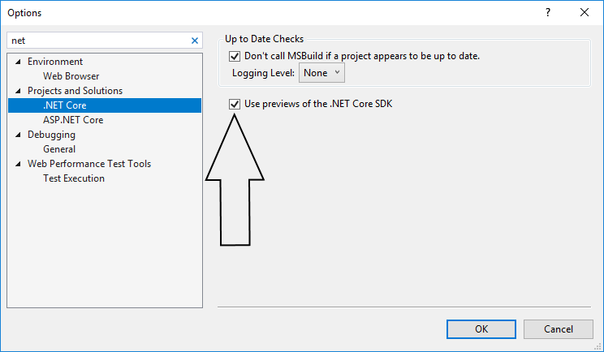
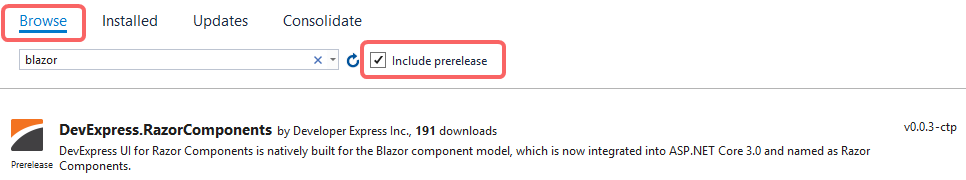

# DevExpress UI for Blazor
This project demonstrates the Preview (CTP) version of [DevExpress UI Components for Blazor](https://www.devexpress.com/blazor/).

The DevExpress UI components featured in this demo are available for free download and can be used in your next Blazor app.* 

> \* Like any software preview, the DevExpress UI for Blazor is not without fault. You should not use these products in production environments or in mission-critical applications.

# Live Demo
 
Check out this [demo in live](https://demos.devexpress.com/blazor/).

# Version compatibility

The following table describes the version compatibility of .NET Core 3.0 Preview and the DevExpress.Blazor NuGet package.

| .NET Core 3.0 version | DevExpress.Blazor.nuget version |
| ------------- | ------------- |
| .NET Core 3.0 Preview **3** | 0.0.**3** |
| .NET Core 3.0 Preview **4** | 0.0.**4** |
| .NET Core 3.0 Preview **5** | 0.0.**5** |

# Set up your environment

1. Install Visual Studio 2019 (latest update).
2. Ensure that you have .NET Core 3 (preview 4) installed.
3. If you work with the release version of Visual Studio 2019, make sure to enable the option "Use previews of the .NET Core SDK".



# How to run this demo on your machine

1. Download the "**demo**" directory from this repository.
2. Open **demo/BlazorDemo.ServerSide/BlazorDemo.ServerSide.sln** in Visual Studio 2019.
3. Start the application.

See also: 

[Official Microsoft Blazor site](https://dotnet.microsoft.com/apps/aspnet/web-apps/client)

# How to create a new project

Follow the steps below to try our UI for Blazor in your own application. 

1. Create a new solution using the "Blazor (server-side)" or "Blazor" template in Visual Studio 2019.

  In the "Create a new project" dialog select "ASP.NET Core Web Application (where the language is C#).
  
  

  In the next step ensure that an "ASP.NET Core 3.\*" framework is selected, and select the "Blazor (server-side)" project template.
  
  

2. Register the DevExpress Early Access feed in Visual Studio's NuGet Package Manager.

  Open the "Package Manager Settings".

  

  Add new NuGet source:
  
  ```https://nuget.devexpress.com/early-access/api```

  

3. Install the "DevExpress.Blazor" NuGet package.

   Navigate to:
   
   
   
   Select the "Early Access" NuGet package source you have just created in the "Package source" combo box.

   Make sure that the "Include prerelease" option is selected.
   
   Install the "DevExpress.Blazor" NuGet package.
   
   

4. Navigate to the GitHub repository and download all files from the "client-runtime" directory. Put the downloaded files into the "wwwroot" directory of your project. Include these files to your start page.
5. Register our tag namespace and helper in _Imports.razor file: 

  ```
  @using DevExpress.Blazor
  ```

6. Your application is ready to use DevExpress Blazor.

# Troubleshooting

## 1. DxDataGrid in Blazor

If you use Blazor (client-side) with DxDataGrid, you may see the following exception in a browser:


> "System.InvalidOperationException: No generic method 'Take' on type 'System.Linq.Queryable' is compatible with the supplied type arguments and arguments."

One solution is described in the [original issue](https://github.com/mono/mono/issues/12917#issuecomment-462925005) on GitHub.

As an alternative solution, your can turn off the linker. To do this, add the following line to the [ProjectName].Client.csproj file:

```
<BlazorLinkOnBuild>false</BlazorLinkOnBuild>
```

Project content should look as follows:

```
<Project Sdk="Microsoft.NET.Sdk.Web">
  <PropertyGroup>
  ...
    <BlazorLinkOnBuild>false</BlazorLinkOnBuild>
  </PropertyGroup>
  ...
</Project>
```
## 2. The "Early Access" NuGet Feed is empty in Visual Studio

If you don't see packages in the ```https://nuget.devexpress.com/early-access/api``` NuGet feed, make sure that the "Include prerelease" option is selected:


# Included Demo Modules

* Data Grid
  * Column Types
  * Templates
  * Large Datasets
* Pivot Grid
  * Data Binding Basics
  * Templates
  * Large Datasets
* Tabs
* Form Layout
* Data Editors
  * Combo Box – Business Object List
  * Combo Box – Cascading Lists
  * Date Edit
  * Spin Edit
  * Text Box
* Pager

# NuGet Package Change Log

Check out thе NuGet package's [version history](changelog.md).
